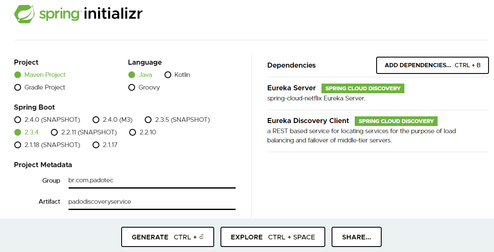

  
  
* Adicionar a anotacao @EnableEurekaServer na classe principal.  
  
*Adicionar em resources/application.properties:
```
server.port=8010
spring.application.name=discoveryservice
eureka.client.register-with-eureka=false
eureka.client.fetch-registry=false
eureka.client.serviceUrl.defaultZone = "http://localhost:8010/eureka"
```